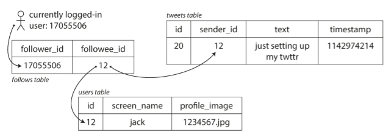
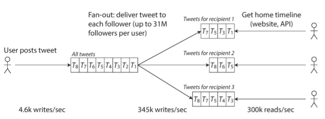

# 1. Reliable, Scalable, and Maintainable Applications

### Overview

- Applications today are *data-intensive* instead of being *compute-intensive*
- Amount of data, complexity of data and speed at which data is changing have become the bigger problems now.
- Data-intensive are built in a very typical fashion from standard building blocks that provide common needed functionality. *(Databases, caches, search indexes, stream processing, batch processing) ⇒ needed by many applications these days*
- Different database systems have different characteristics and they are designed to serve different requirements.

### Thinking About Data Systems

- Typically databases, queues, caches etc. are thought of as very different categories of tools. But in reality, they are superficially similar. Example ⇒ a database and message queue share the same purpose - "*to store data"*
- These tools no longer neatly fit into their traditional categories. Some datastores are used as message queues like Redis. Some message queues posess database-like durability like Apache Kafka.
- A single tool is no longer meant to satisfy all the growing demands of applications. Instead, the application is broken down into tasks where each task can be performed efficiently on a single tool, and those tools are tied together using application code. **Example ⇒ If the application has a caching layer (managed by an application using Memcached) or a full-text search server ~ indexes (like Elasticsearch) separate from the main database**; it's the responsibility of the application code to keep caches and indexes in sync with the main database.
- API hiding underlying implementations -
    

- By glueing multiple tools together and then hiding theirr internal implementations from clients helps in creating ***special-purpose data system from smaller general-purpose components***.
- While desiging data sy8stems multiple questions are unanswered.
    - How to ensure data remains consistent in case of failure?
    - How to provide consistently good performance to clients even when some parts of system are degraded?
    - How to scale to handle increase in load?
    - What does good API design look like?

### 3 concerns in software systems

***Relability: System should continue to work correctly even in face of adversity***

- Reliability can be broadly defined as *'The Application performs functions that user expected'* **OR**  *'It can tolerate user's mistakes'* **OR** '*Its performance is good enough for the use-case under expected load and volume*' **OR** *'System prevents unauthorized access'*
- Long story short ⇒ **'Systems continue to work correctly even when things go wrong'**
- **Things that go wrong are called 'faults' and systems that cope-up with them are called 'fault-tolerant' systems.**
- Fault vs failure -
    - fault := one component of system deviates from its spec
    - failure := system as a whole stops providing required service to user
- On the contrary, it makes sense to increase the rate of faults by triggering them deliberatly sometimes. Example - randomly killing individual processes without warnings. By doing this you ensure that the fault-tolerence machinery is continually exercised and tested.
- Hardware faults: HDD's - MTTF about 50-60 years. On a storage cluster with 10,000 disks, on an average one disk should die per day.
- Software failures - **cascading failures** : one bug triggers issues in other apps. Service that the system depends on slows down, app crashing because of particular bad input.

***Scalability: System should be capable of handling ways of dealing with growth in data volume, traffic volume or complexity***

- It is not necessary for a system to be reliable at every timestamp. In cases when there is sudden increase in the load on one component of application; there has to be proper mechanisms in place to handle the additional load.
- Scalability - systems ability to cope with increased load.
- **Understanding Load**

    The load can be described with the load params like `requests per second to a web server`, `number of reads in the database`, `number of simultaneous users actively` chatting in the chat room, etc. To elaborate on describing load, let's consider an example of Twitter.

    Couple of main operations of Twitter **(as of 2012)**- 

    1. *Post tweet*: User can publish a new message to their followers. (4.6k requests/second on average and 12k requests/second on peak)
    2. *View timeline*: User can view tweets posted by people they follow. (300k requests/second)

    Handling 12k writes per second isn't a big deal for Twitter; the main challenge is due to fan out i.e. each user follows many people and each user is being followed by many people. There are two ways of implementing this operation -

    - Simply inserting tweet into global collection of tweets. When user requests their home timeline, lookup all the people they follow, find all tweets for each of those users and merge them.

        

        Relational schema for implementing twitter home timeline

    - Maintain a cache for each user on a home timeline like a mailbox of tweets for each recipient user.  So each user posts a tweet. In the meantime, we look up all the people who follow that user. Next, from the mailbox, we insert each tweet into the mailbox of each recipient that follows the user. The request to read the home timeline is cheap because the results have been computed ahead of time.

        

        Twitter's data pipeline for delivering tweets to followers with load parameters

    ⇒ Version 1 failed to keep up with the load of home timeline queries so company switched to approach 2. This works better because the average rate of published tweets is **two order of magnitude** less than the rate of home timeline reads and **so its preferable to do more work at write time** and less at read time. 

    ⇒ The downside of version 2 is that posting a tweet requires a lot of extra work. On average, a tweet is delivered to about 75 followers, so 4.6k tweets per second become 345k writes per second to the home timeline caches. However, the average is the catch here. Not all users have a mere 75 followers, some users even have 30 million followers. This means that a single tweet results in 30million write to home timelines of different users. 

- **Describing performance**
    - Performance comes into picture when the load on system increases. There are two ways of looking into this thing -
        - ***How is the performance of your system affected when the load parameter is increased and the system resources is unchanged?***
        - ***How much do you want to increase the resources when the load parameter is increased and performance is unchanged?***
    - To answer both the questions, we require numbers. So lets take an example of Batch processing system like Hadoop.
    - In a batch processing system, we care about throughput - the number of records that can be processed per second or the total time it takes to run a job on a dataset of a certain size. However, in online systems what's usually important is the service's response time.
    - ***Vocab alert**: Latency and response time are used synonymously but they aren't the same. Response time:= time to process the request + network delays and queuing delays.  Latency time:= Duration that a request is waiting to be handled i.e. during which the request is latent or awaiting service.*
    - Response time is not a single number. It can be considered as a distribution of values that you can measure.
    - Use median to sort the response times in descending order. Lets say if the median response time is 200ms this means that half the requests return in < 200 ms. And half the requests take longer than that.
    - To figure out how bad the outliers are in the requests sent, we can look at higher percentiles. Higher percentiles are also called **tail latencies** which directly impact the user experience of service. Customers with the slowest requests are the ones who have the most data on their accounts because they have made purchases. Amazon use-case example in tail latencies
    - Tail latency amplification - Even if a small % of end-user requests require multiple backend calls, there is a high chance of getting a slow call if the end-user request requires multiple backend calls. Thus, a higher proportion of end-user requests end up being slow.
    - If you want to monitor response times for a service on a dashboard, you need to monitor it on an ongoing basis. A good idea is to keep a rolling window of response times of requests in the last 10 minutes. So there could be a graph of the median and various percentiles over that window.
    - *Averaging percentiles is useless, the right way of aggregating response time data is by adding histograms.*
- **Approaches for coping with load**
    - *Scaling up* or *vertical scaling*: Moving to a more powerful machine
    - *Scaling out* or *horizontal scaling*: Distributing the load across multiple smaller machines.
    - *Elastic* systems: Automatically add computing resources when detected load increase. Quite useful if load is unpredictable.

    Distributing stateless services across multiple machines is fairly straightforward. Taking stateful data systems from a single node to a distributed setup can introduce a lot of complexity. Until recently it was common wisdom to keep your database on a single node.

***Maintainability: People work on a system that undergoes several changes throughout its development cycle. The systems should be designed in a manner in which people will be able to adapt to the changes easily and work on them productively.***

- Majority of software requires ongoing maintainence. Every legacy system is unpleasant in its own way, and so its difficult to give general recommendations for dealing with them.
- Design software in a manner that it will minimize pain during maintainence and thereby avoid creating legacy software ourselves.
- Three design principles for software systems pertaining to maintainence -
    - *Operability* - Make it easy for ops teams to keep the systems running smoothly. A system is said to have good operability if it makes routine tasks easy so that it allows the operations teams to focus their efforts on high-value activities. Data systems can do the following to make routine tasks easy e.g.
        - Providing visibility into the runtime behavior and internals of the system, with good monitoring.
        - Providing good support for automation and integration with standard tools.
        - Providing good documentation and an easy-to-understand operational model ("If I do X, Y will happen").
        - Self-healing where appropriate, but also giving administrators manual control over the system state when needed.
    - Simplicity - Make it easy for new engineers in the team to understand the system by removing complexity. Reducing complexity improves software maintainability, which is why simplicity should be a key goal for the systems we build. Abstraction is one of the best tools that we have for dealing with accidental complexity. A good abstraction can hide a great deal of implementation detail behind a clean, simple-to-understand façade.
    - Evolvability - Make it easy for engineers in the team to change the system in the future. System requirements change constantly and we must ensure that we're able to deal with those changes.