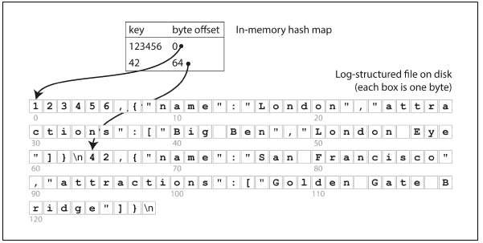
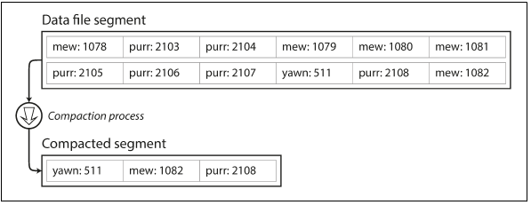
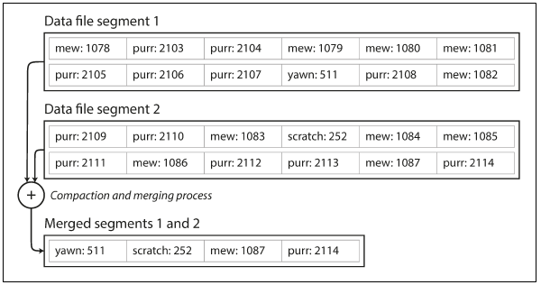
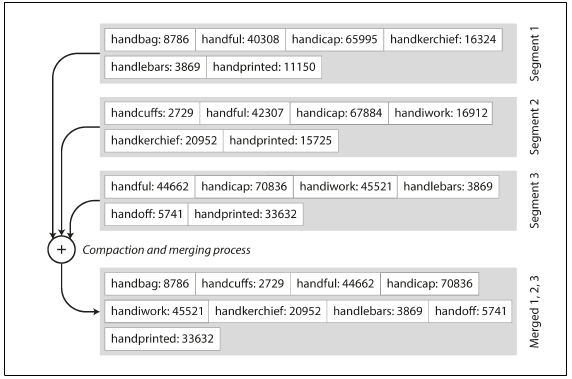
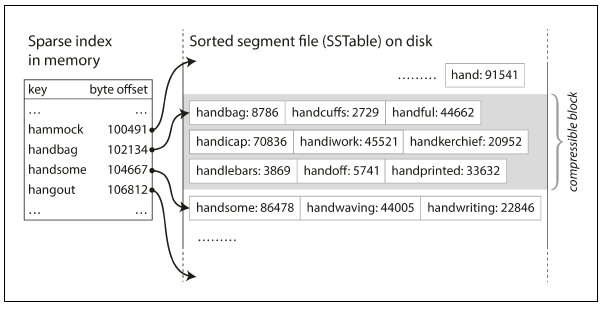

# 3. Storage and retrieval

### Overview

- You’re probably not going to implement your own storage engine from scratch, but you do need to select a storage engine that is appropriate for your application, from the many that are available. In order to tune a storage engine
to perform well on your kind of workload, you need to have a rough idea of what the storage engine is doing under the hood.
- There is a big difference between storage engines that are optimized for transactional workloads and those that are optimised for analytics.
- Two families of storage engines ⇒ log-structured & page-oriented

### Data Structures That Power Your Database

- A very simple bash-kinda database can be achieved like this -

    ```bash
    #!/bin/bash
    db_set () {
    echo "$1,$2" >> database
    }
    db_get () {
    grep "^$1," database | sed -e "s/^$1,//" | tail -n 1
    }
    ```

- The underlying storage for the bash-kinda database is a **text file where each line contains a key-value pair separated by a comma**. Every call to `db_set` **appends data to the end of the file**. If we update a key several times, the value is not overwritten, they are appended to the key. We need to call the `tail -n 1` in db_get to get the latest value associated with the respective key.
- **The performance of db_set is pretty good because appending something to a file is generally very efficient**. **The cost of db_set operation in average case is O(1) assuming you have a pointer for the last write.**  Many databases internally use a **log which is an append-only data file.** However, real databases have more issues to deal with like concurrency control, reclaiming disk space so that the log doesn't grow forever, handling errors, etc.
- **The performance of db_get is terribly poor if we have a large number of records in the database.** Every time while performing a lookup, db_get has to scan the entire database file from beginning to end looking for occurrences of key. **The cost of lookup is O(n) where n is the size of records in the database.**
- **To efficiently find the value of a particular key in the database, we need a different data structure - index**. The general idea behind indexing is ⇒ to **keep some additional metadata which acts as a signpost and helps us locate the data we want.**
- Indexes are derived from primary data. Adding/removing indexes doesn't have impact on the actual data in database; it only affects the performance of database queries.
- **Maintaining additional structures(indexes) on the database incurs overhead, especially on writes.** Any index slows down the write because the index also needs to be updated every time data is written. ***Well-chosen indexes speed up read
queries, but every index slows down writes.***

- **Hash Indexes -**
    - Key value stores are based on dictionary type which are implemented as a hashmap.
    - For data storage having to append to a file feature, the simplest indexing strategy is to keep an in-memory hashmap where every key is mapped to byte offset in data file(the location where data is found. When a new value is appended to the key, we update the hashmap's byte offset to point to a new location in memory. When we have to lookup for a value, use hashmap to find offset in the data file, seek to that location and read the value.

        
        
        indexing with in-memory hashmap with byte offset.

    - This is a simplistic but viable approach. **Bitcask(default storage engine for Riak) uses this technique. They provide high-performance reads and writes(with a requirement that all keys fit in the RAM). The values can be loaded and unloaded from the disk with just one disk seek.** Also, if some amount of data from the disk is already in the cache; then we don't need any disk to seek operation at all.
    - A storage engine like bitmask is well-suited for scenarios **where the value for each key is updated frequently**. For example, the key might be the URL of a video and the value can be the number of views for that video.
    - Appending to a single file might result in running out of disk space. A **good solution is to break log into segments of a certain size by closing the segment file when it reaches size and make subsequent write to a new segment file.** *Compaction* (removing duplicate keys in the log) has to be performed on multiple segment files.
    - Compaction makes segments smaller as the key is overwritten several times on average within one segment; we can merge several segments together at the same time as performing the compaction. Segments are never modified after they are written so the merged segment is written to a new file. Merging and compaction of frozen segments can be done in a background thread. While in the meanwhile, we can continue reading and writing requests as normal with older segment files. Once the merging is complete, we switch read requests to use the newly merged segments instead of old segments.

        
        
        compaction of key value update log 

        
        
        compaction and segment merging simultaneously.

    - Each segment has its own in-memory hash table that maps keys to file offsets. To find a value for the key, check the most recent segment's hash map; if key, not present - check subsequent segments and so on.
    - Following are few design considerations for a compaction, merge segment log in real world -
        - **File format:** *CSV is not the best format for log. A binary format is faster and simpler as it first encodes length of string in bytes followed by raw string.*
        - **Deleting records:** *To delete key-value pair, append a special deletion record to a data file called a tombstone. When log segments are merged, the tombstone tells the merging process to discard any previous value for the deleted key.*
        - **Crash recovery:** *On a restart, in-memory hash maps are lost. So in practice, we can restore each segment's hashmap by reading the entire segment file from beginning to end and tracking offset for the most recent value for every key as we go along. This is a very time-consuming process if segment files are large. Another idea is to keep a snapshot of the segment's hashmap on disk,*
        - **Partially written records:** *The database can crash at any moment. You need to include checksums for detecting corrupted records.*
        - **Concurrency control:** *Since writes are appended sequentially, common implementation is to have only one writer thread. For reads, we can have multiple threads as data file segments are append-only and otherwise immutable.*
    - **Append only logs advantages -**
        - Append and segment merge are sequential write operations that are much faster than random writes especially on magnetic spinning disk hard drives. Sequential writes are also preferred for SSD's
        - Concurrency and crash recovery are much simpler if segment files are append-only or immutable.
        - Merging old segments avoids the problem of data files getting fragmented over time.
    - **Hash table index limitations -**
        - The Hash table must fit in memory. If we have a large number of keys, this approach doesn't work well.
        - Range queries are not efficient. For example - we cannot easily scan over all keys between a given range. We have to look up each key individually in the hash maps

- **SSTables & LSM-Trees -**
    - In append only segment log, each log-structured storage segment is a sequence of key-value pairs. *They appear in order of writes(first key-value pair) and the values later in log take precedence over values for same key earlier in log(subsequent values for same key)*.
    - **Sorted String Tables(SSTables) - Sequence of key-value pairs sorted by key. Also, each key only appears once within each merged segment file.**
    - **Advantages of SSTables over log segments with hash indexes:**
        - Merging segments is simple and efficient. Even if files are bigger than the available memory. How? - Read input files side by side, look at the first key in each file, copy the key according to sort order to the output file. Repeat this until all keys are copied to the output file(Similar to merge sort)

            
            
            merging SSTables and retaining only most recent value.

        - **No need to keep an index on all keys in memory.** For example, if you don't know the exact offset for the word 'handiwork' in the segment file. But you know the offsets for the keys 'handbag' and 'handsome' and since SSTables are sorted; you also know that 'handiwork' will lie between the two. This means that you can jump on the offset for 'handbag' and start scanning until you find 'handiwork'. ****

            

        - Sparse indexes are needed and not dense ones for SSTables.
        - **Since read requests need to scan over several key-value pairs in the requested range anyway, it is possible to group those records into a block and compress it before writing them to disk.** Each entry of the sparse in-memory index then points at the start of a compressed block.
        Besides saving disk space, compression also reduces the I/O bandwidth use.
    - **Constructing and maintaining SSTables**
        - Maintaining a sorted structure on the disk is possible by utilizing data structures like AVL trees or Red-Black trees. With these data structures, we can insert keys in any order and read them back in sorted order.
        - The storage engine will work as follows:
            - *When a write comes in, add it to an in-memory balanced tree data structure (for example, a red-black tree) called the **memtable**.*
            - *When the memtable gets bigger than some threshold - typically a few megabytes - write it out to disk as an SSTable file. This can be done efficiently because the tree already maintains the key-value pairs sorted by key. The new SSTable file becomes the most recent segment of the database. While the SSTable is being written out to disk, writes can continue to a new memtable instance.*
            - *In order to serve a read request, first, try to find the key in the memtable, then in the most recent on-disk segment, then in the next-older segment, etc.*
            - *From time to time, run a merging and compaction process in the background to combine segment files and to discard overwritten or deleted values.*
    - **Making LSM-tree out of SSTables**
        - **LevelDB and RocksDB have their key-value storage engine algorithm based on SSTables. Similar storage engines are used in Cassandra and HBase.**
        - SSTables and memtable were earlier introduced in Google BigTable paper. Originally this indexing structure was described under the name **Log-Structured Merge-Tree. Storage engines that are based on the principle of merging and compacting sorted files are often called LSM storage engines.**
        - **Lucene**, an indexing engine for full-text search used by Elasticsearch and Solr, uses a similar method for storing its term dictionary.  In Lucene, the mapping from term to postings list is kept in SSTable-like sorted files which are merged in the background as needed.
    - **Performance optimizations**
        - For the storage engine, using LSM-tree algorithm can be slow while performing lookup for keys that do not exist in database. To optimize this kind of access, storage engines often use additional **Bloom Filters.**
        - Different strategies to determine the order and timing of how SSTables are compacted and merged; most common being **size-tiered and leveled compaction.**
        - In size-tiered compaction, newer and smaller SSTables are successively merged into older and larger SSTables. In leveled compaction, the key range is split up into smaller SSTables and older data is moved into separate “levels,” which allows the compaction to proceed more incrementally and use less disk space.
- **B Trees**
    - Use same technique of key-value pairs sorted by key but with a completely different design philosophy - **Breaking the database down into fixed-size blocks or pages(typically 4KB in size) and read/write one page at a time. ~This design corresponds to disk as they too have fixed-size blocks.**
    - Each page can be identified using **an address or location** which allows one page to refer to another (very similar to pointer) but on disk instead of memory.

        

        looking up a key using a b-tree index

    - In a B-tree you have a root page, from where you start your lookup. Next, we traverse the tree in a top-down manner until we reach a page containing individual keys(leaf page), which either contain value for each key inline or contain references to pages where values can be found.
    - Branching factor - number of references to child page in one page. It depends on amount of space needed to store the page references and range boundaries.
    - To add a key, find a page that encompasses it and add it to that page if there is space; if there is no space, split the page into two pages and then add. To update a key, search for node/leaf containing the key, change the value and write page back to disk. These operations ensure that tree remains **balanced.**
    - **For n keys, we have a depth of O(n log n) for B Trees.** **Most databases fit in 3/4 levels of depth. A 4-level tree of 4KB in size has a branching factor of 500 and it can store upto 256 TB.**
    - **Making B-Tree's reliable -**
        - **The basic operation of B-Tree is to overwrite a page on disk with new data.** [with an assumption that this overwrite doesn't change the location of page](All references to page remain intact when page is overwritten)
        - Overwrite is an actual hardware operation on disk. ⇒ [on an HDD, move the disk head to right place, wait for right position on spinning platter and then overwrite appropriate sector with new data]. However, some operations require several different pages to be overwritten. While splitting up a page into two, you need to overwrite their parent page to update referemces to two child pages. This is a dangerous operation because if the database crashes after only some of pages have been writtern, we end up with a corrupted index.
        - **To make B-Tree's resilient to crashes**, its common for B-Tree implementations to include an additional data structure called as ***write-ahead log(WAL)***. Its an append-only file to which every B-Tree modification must be written before it can be applied to pages of tree itself. When the DB comes back up after crash, this log is used to restore B-Tree back to consistent state.
        - **Careful concurrency control** needed incase of multiple threads accessing B-Tree at the same time. *Use latches around pages in B-Tree.*
    - **B-Tree optimizations -**
        - Instead of overwriting pages and maintaining a WAL for crash recovery, some
        databases (like LMDB) use a copy-on-write scheme. ⇒(Modified page written to new location and new version of parent page is generated with reference at new location.
        - Save space in pages by not storing entire key, but providing abbreviations to it. Packing more keys in trees allows tree to have higher branching factor and thus lesser levels. Also, keys only need to provide the minimal information of boundary keeping between ranges.
        - Pages, can be positioned anywhere on disk. You don't need to maintain locality of reference in this situation. (pages with nearby key ranges to be nearby on disk)
        - Additional sibling pointers added to B-Tree which allows performing lookup at same level instead of jumping back to parent page.
        - Fractal trees (B-Tree variant) borrow some log-structured ideas to reduce disk seeks.

- **B-Tree VS LSM-Tree**
    - B-trees are a mature, well established technology providing good performance across a range of workloads, but LSM-trees have some interesting properties.
    - **LSM-trees are typically faster for writes and hence they are used heavily in write-heavy applications.**
    - **Conventional wisdom is B-trees are faster for reads, but may depend on workload.**
    - **Advantages of LSM-trees include:**
        - Lower write amplification - **SSTable compaction versus B-trees writing entire pages even if only one record changed.**
        - LSM-trees can be **compressed better and don’t suffer as much internal fragmentation** as B-trees.
        - They have **lower storage overheads**, especially when using leveled compaction.
    - **Downsides of LSM-trees include:**
        - Background compaction processes can sometimes **interfere with/slow writes.**
        - In the extreme, **if write activity is high enough, compaction may not be able to keep up.**
        - **If number of SSTables grows, performance will degrade**. Typically, administrators will have to explicitly monitor for this scenario.
        - The bigger the database gets, the **more disk bandwidth is required for compaction.**
        - **Transactional functionality is easier to implement with B-trees** given that each key exists only once, and locks are straightforward to implement on ranges of keys.

- **Other indexing structures**
    - It's a common thing to have a secondary index. They are crucial for performing joins efficiently. A secondary index is constructed from the key-value index. The main difference is that the keys are not unique. (multiple rows having the same keys). This can be solved in two ways - making each value in the index a list of matching row identifiers OR by making each key unique by appending a row identifier to it.
    - **Storing values within the index -**
        - The **key in an index is the thing that queries search for**, but the value can be one of two things: **it could be the actual row** (document, vertex), or it could be **a reference to the row stored elsewhere. The place where rows are stored is also known as a heap file which stores data in no particular order.** Heap files avoid data duplication when multiple secondary indexes are present.
        - When updating value without changing the key, the heap file approach is efficient. The record can be overwritten in place, provided that the new value is not larger than the old value. If the new value is larger than the old then it needs to be moved to a new location with enough space in the heap. In this case, all indexes have to be updated to point to a new location, or a forwarding pointer is left behind in the old heap location.
        - **Storing indexed rows directly within an index is called a clustered index.** In MySQL's InnoDB; the primary key is always a clustered index and secondary indexes refer to the primary key. We need clustered indexes because the extra hop from the index to the heap file is too much of a performance penalty.
        - A compromise between a clustered index and a non-clustered index is called a **covering index**(index with included columns). This index stores some of a table's columns within the index and it allows some queries to be answered using the index alone.
    - **Multi-column indexes -**
        - To query multiple columns of the table, the mapping of a single key to a value(indexes so far) doesn't work. For this purpose, we need multi-column indexing and the most common of them is **concatenated index** ⇒ that **combines several fields into one key by appending one column into another** (the index definition specifies the order in which fields are concatenated)
        - **They are a general way of querying several columns at once which is really useful geospatial data.** For example, a restaurant search website has a database containing the latitude and longitude of each restaurant. When a user requests for all restaurants from a particular area on map, then, we need a two-dimensional query(<> latitude co-ords & <> longitude co-ords). Standard B-Tree or LSM index won't be able to get the latitude and longitude data simultaneously. [One option —> Translate 2D indexes into single number using space-filling curve and then to usee a regular B-Tree index]
        - For an eCommerce website, we can use a 3D index on the dimensions (RGB) to search for products in a certain range of colors. For a database of weather observations, we can have a 2D index(date, temperature) to search for all observations based on the 2D index.
    - **Full-text search & fuzzy indexes -**
        - Similar to fuzzy search. [To query for keys that are not exact or within a range in sorted order]. Example - search for similar keys such as misspelled words.
        - Full-text search engines commonly allow a search for one word to be
        expanded to include synonyms of the word, to ignore grammatical variations of words, and to search for occurrences of words near each other in the same document, and support various other features that depend on linguistic analysis of the text.