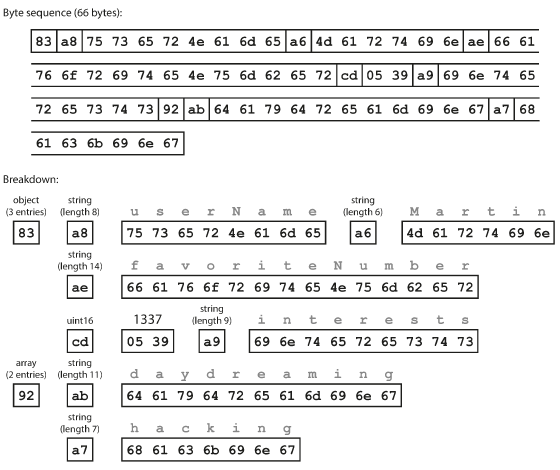
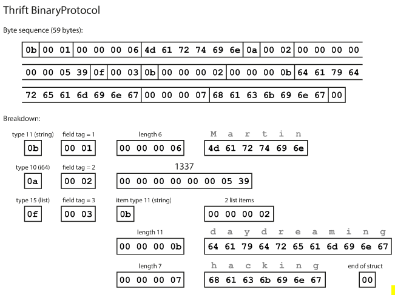
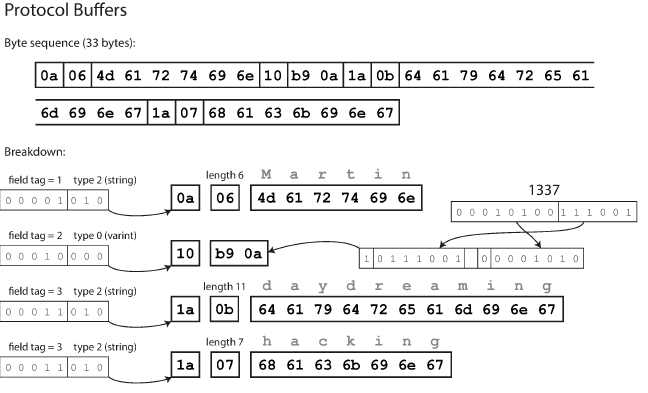

# 4. Encoding and Evolution

Lesson Date: Feb 9, 2021 → Feb 13, 2021
Status: In Progress
Type: Lesson

### Overview

- Applications change over time and features are added/removed as new products are launched. The aim is to build systems that make it easy to adapt to change.
- Changing an application in most cases triggers a need to change the data associated with it. Different data models have different ways of coping with the changes. If the data schema/model changes, the supporting application code also undergoes a change.
- Here, we will look at several formats for data encoding including JSON, XML, Proto Buffers, Thrift  and Avro.

### Formats for Encoding Data

- Two data representations -
    - **In memory** - data persisted in objects, structs, lists, hash tables, arrays, trees etc.
    - **Writing data to file or sending it over a network** needs data to be encoded into a self-contained sequence of bytes.
- We need a translation layer between two representations.
    - **Encoding/marshalling/serialization:** inmemory ⇒ byte sequence
    - **Decoding/unmarshalling/deserialization:** byte sequence ⇒ inmemory
- **Problems with language-specific encoding formats -**
    - Often tied too closely with the programming language. Both, the sender and the receiver require same language to perform serialization and deserialization.
    - To restore data in same object types, decoding process needs to be able to instantiate arbitary classes.
    - Versioning becomes difficult with these libraries.
    - They are not that efficient.
- **Standardized encodings -**
    - Can be written & read by different programming languages. JSON and XML are the most common form of standard encodings. JSON, XML, and CSV are human-readable as they are in textual format.
    - Ambiguity around encoding of numbers. (In XML and CSV we cannot distinguish between numbers and strings containing numbers. In JSON, we cannot distinguish integers and floating-point integers.
    - JSON and XML have good support of Unicode Characters but they don't support binary strings. Binary strings are usually encoded as Base64 but it increases encoding size by 33%. CSV doesn't have any schema so it's up to the application to decide which kind of schema has to be used for rows and columns.
    - Despite the above 2 flaws, JSON, XML and CSV are good enough for many purposes.
- **Binary encoding -**
    - For data used internally within the organization, there is less pressure to use an LCD encoding format. We can choose a format that is more compact or fast to parse. For a small dataset, the gains are negligible but for the larger dataset, the choice of data format has a big impact.
    - JSON is less verbose than XML, but both use lot of space as compared to binary ones which led to a fusion of binary encodings and JSON(MessagePack, BSON, UBJSON, BISON, etc.) & for XML(WBXML). For the following record, we have a MessagePack schema as follows -

        ```json
        {
        "userName": "Martin",
        "favoriteNumber": 1337,
        "interests": ["daydreaming", "hacking"]
        }
        ```

        

        Encoding data using WebPack schema produces an encoding alike above

- **Thrift and Protocol Buffers -**
    - Binary encoding libraries. Both of them need a schema for any data that is encoded.
    - To encode data in Thrift ⇒ we describe schema in **Thrift interface definition language** as ⇒

        ```c
        //Thrift schema
        struct Person {
        	1: required string userName,
        	2: optional i64 favoriteNumber,
        	3: optional list<string> interests
        }

        //Protocol Buffers schema
        message Person {
        	required string user_name = 1;
        	optional int64 favorite_number = 2;
        	repeated string interests = 3;
        }w
        ```

    - For the thrift schema above, we get an encoding of the message below -
    - Thrift has two different encoding formats **ThriftBinaryProtocol** and **ThriftCompactProtocol**. The Compact protocol is a compact version of the binary protocol.

        

        

    - Following is the data encoding for ProtocolBuffer Schema -

          