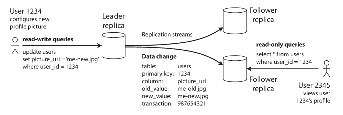

# 5. Replication

### Overview

- Replication - Keeping a copy of the same data on multiple machines connected via a network.
    - Why? - Keeping data geographically close to users(reduce latency). Allow the system to continue working even if some parts have failed(high availability).  Scale-out a number of machines that serve read queries. (increased throughput)
    - Here we assume that the database is so small that each machine can hold it. If the data that you are replicating doesn't change over time, we just have to replicate/copy data to every node once.
    - When data is changing, it becomes difficult to implement replication. There are 3 popular algorithms for replication to be looked into - single leader, multi leader, and leaderless.
    - Many trade-offs need to be considered for replication - synchronous vs asynchronous replication; how to handle failed replicas, etc.

### Leaders and Followers

- Each node stores a copy of the database called a replica. With multiple replicas, how to ensure that there is consistency between both the databases is a primary concern. Every write must be followed/processed by a replica.
- **Leader-based replication(master-slave replication) -**
    - One replica ⇒ leader.  Whenever clients want to write to the database, they send requests to the leader which first writes data to its local storage.
    - Other replicas ⇒ followers. The leader also sends the changed data to all of its followers other than writing it to its local storage. (This is called change stream/replication log) Each follower takes the log from the leader and updates its local copy of the database accordingly.
    - When the client wants to read the database it can either query the leader or any of its followers. Writes have to go through the leader.

        

    - This mode of replication is a built-in feature for most relational databases like PostgreSQL, MySQL, SQL Server, etc. It is also used in MongoDB, RethinkDB, Espresso.
    - Leader Based replication is also employed in Distributed Message Brokers like Kafka and RabbitMQ.

### Synchronous vs Asynchronous replication

- Scenario - When a user wants to update profile picture in the database. A leader with a synchronous and an asynchronous follower -

    

- The replication to follower 1 is synchronous. Leader waits until follower 1 has confirmed that it received the write before reporting success to the user.  The replication to follower 2 is asynchronous.  The leader sends a message but doesn't wait for a response from the follower.
- Normally replication is very fast and most database systems apply changes in less than a second.
- Synchronous replication guarantees that follower has an up-to-date copy of data consistent with the leader. Disadvantage is that if the follower doesn't respond back, the write cant be processed.
- **Semi-synchronous** - In general scenarios, it is impossible for all the followers to be synchronous. Even a single node outage would cause the whole system to halt. In practice ⇒ synchronous replication on a db ⇒ one of the followers is synchronous.  The above configuration guarantees that you have at least two machines that are always up to date(leader and one sync follower).
- **Often leader-based replication is configured asynchronously. The write is not guaranteed to be durable.**  However, a fully asynchronous configuration has the advantage that the leader can continue processing writes, even if all of its followers have fallen behind.
- **Weakening durability may sound like a bad trade-off, but asynchronous replication is nevertheless widely used.**