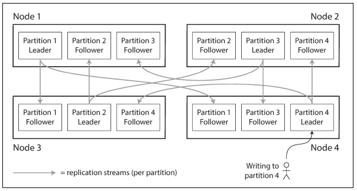
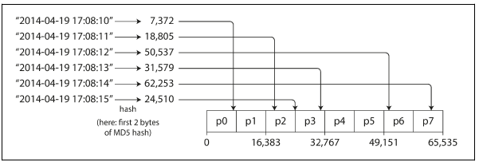
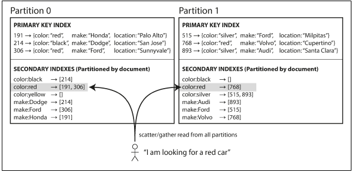
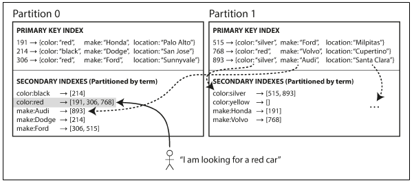

# 6. Partitioning

### Overview

- **Partitioning** - **For very large datasets, or very high query throughput, that is
not sufficient: we need to break the data up into partitions, also known as sharding.**
- **Partitioning == shard == region == tablet == vnode == vbucket**
- Each partition is a small database of its own as each piece of data belongs to exactly one partition.
- Why? ⇒ To achieve scalability and distribute query load across multiple processors.

### Partitioning and Replication

- Partitionining + replication ⇒ Copies of each partition are stored on multiple nodes.
- One node can store multiple partitions. In a master-slave architecture, we can have each partition's leader assigned to one node and its followers assigned to other nodes. A node can be a leader for one partition and a follower for some other.

    

- **Goal of partitioning ⇒ spread data & query load evenly across nodes**. If every node takes a fair share, in theory, 10 nodes can handle 10x times data and 10x times read and write throughput in comparison to a single node.
- Unfair partitioning results in skewing of either data and queries towards certain partitions. Skewed partition makes the idea of partitioning less effective. In the worst case, all the load of the application can end up on a single node, so 9/10 nodes are idle which can be a performance bottleneck. **Partition with disproportionately high load ⇒ hotspot**
- A really simple approach to avoid hotspots is to assign records to nodes randomly. This creates a good balance between partitions in terms of the distribution of data. However, while trying to access an item, it becomes really difficult to figure out in which partition a particular node lies.
- **Partitioning by key-range:**
    - Assign continous range of keys to each partition ⇒ similar to volumes of paper encyclopedia.
    - If we know the boundaries between ranges, it becomes really easy to query data/key from respective partitions. It also becomes really easy to query an appropriate node, if we know the mapping between a respective partition to a node.
    - The distribution of key ranges is not evenly spread out as the data is not evenly distributed. To distribute data evenly, partition boundaries need to adapt to the data.
    - Used in RethinkDB, MongoDB as the partitioning strategy.
    - Within each partition, keys can be kept in sorted order using SSTables and LSM-Trees. This brings various advantages like easy range scans, allows fetching several related records in a single query with the help of treating key as a concatenated index. Range scans are useful in cases where applications deal with timestamp data. (application having data from a network of sensors)
    - **Advantage: Range scans are easy keeping in mind that keys are evenly distributed.**
    - **Disadvantage: Access patterns can lead to hotspots.**
        - If key is timestamp, then each partition corresponds to each range of time. One partition / day.  Since we write data to the database with primary key as timestamp, all writes will end up going to same partition for the respective day, thereby creating a load on the respective write partition while others sit ideal.
- **Partitioning by hash of key:**
    - key-range partitioning is not a great idea because of skews and hotspots ⇒ Using a hash function to determine partition for key.
    - For partitioning ⇒ hash function needn't be strong. Cassandra and MongoDB use MD5.

        

    - Partition boundaries can be evenly spaced or they can be choosen pseudorandomly(consistent hashing ⇒ a way of evenly distributing load across an internet-wide system of caches such as a content delivery network (CDN). It uses randomly chosen partition boundaries to avoid the need for central control or distributed consensus.)
    - Disadvantage: Not possible to do efficient range queries since keys are scattered because the partitioning is done according to hashes.
    - In real implementations:
        - Range queries on the primary key are not supported by Riak, Couchbase, or Voldermort.
        - MongoDB sends range queries to all the partitions.
        - **Cassandra** has a nice compromise for this. A table in Cassandra can be declared with a compound primary key consisting of several columns. Only the first part of the key is hashed, but the other columns act as a concatenated index. Thus, a query cannot search for a range of values within the first column of a compound key, but if it specifies a fixed value for the first column, it can perform an efficient range scan over the other columns of the key.
- **Skewed workloads and relieving hotspots:**
    - Using hashing on the key to determining partition can avoid hotspots but it can't avoid them entirely. In the worst case, if reads and writes are for the same key; we can end up with all requests on the same partition.
    - **Most data systems are not able to automatically compensate for such a highly skewed workload, so it’s the responsibility of the application to reduce the skew.** For example - if one key is known to be very hot, a simple technique is to add a random number to the beginning or end of the key. **Just a two-digit decimal random number would split the writes to the key evenly across 100 different keys,** **allowing those keys to be distributed to different partitions.**
    - But if we split writes across different keys, we need additional work with reads to read data from all 100 keys and combine it. This needs additional bookkeeping - it only makes sense to append a random number for a small number of hotkeys.
    - For the vast majority of keys with low write throughput, using decimal numbers will be adding unnecessary overhead. There needs to be a way to keep track of which keys are being split.

### **Partitioning and Secondary Indexes**

- Secondary indexes are usually used for searching for occurrences of a particular value rather than uniquely identifying a record. The problem with secondary indexes is that they don’t map neatly to partitions. Two approaches to achieve partitioning a database with secondary indexes.
- **Partitioning Secondary Index by Document:**
    - Here, each partition is completely separate: **each partition maintains its own secondary indexes, covering only the documents in that partition**. [Also known as **scatter/gather**]
    - Whenever you need to write to the database—to add, remove, or update a document—you only need to deal with the partition that contains the document ID that you are writing.

        

    - Since we deal with documents only in the respective partition, the document-partitioned index is called the **local index.**
    - **Challenges**: Reading from a document-partitioned index needs to be done carefully ⇒ You need to query all the partitions and combine all the results. This technique makes read queries on secondary indexes really expensive.
    - Scatter/gather is prone to **Tail latency amplification.** But it is widely used in MongoDB, Riak, Cassandra, Elasticsearch, etc.
- **Partitioning Secondary index by Term:**
    - Rather than each partition having its own secondary index (a local index), we can construct a global index that covers data in all partitions. We can't store the global index on a single node because it can become a bottleneck. So the global index also must be partitioned.

        

    - Here in the above diagram, red cars from all partitions appear under color: red in the index, but the index is partitioned so that colors starting with the letters a to r appears in partition 0 and colors starting with s to z appear in partition The index on the make of car is partitioned similarly (with the partition boundary being between f and h).
    - This kind of indexing scheme is called a term-partitioned index because here the term we are looking for determines the partition of the index. Again, we can partition the index by the term itself or by the hash of the term. Partitioning by the term is useful for range scans and partitioning by the hash of term is useful for even distribution of load.
    - **Advantage: This technique makes reads more efficient as compared to the document-partitioned index.**
    - **Disadvantage: Here, the writes are slower and more complicated because a write to a single document may now affect multiple partitions of the index.**